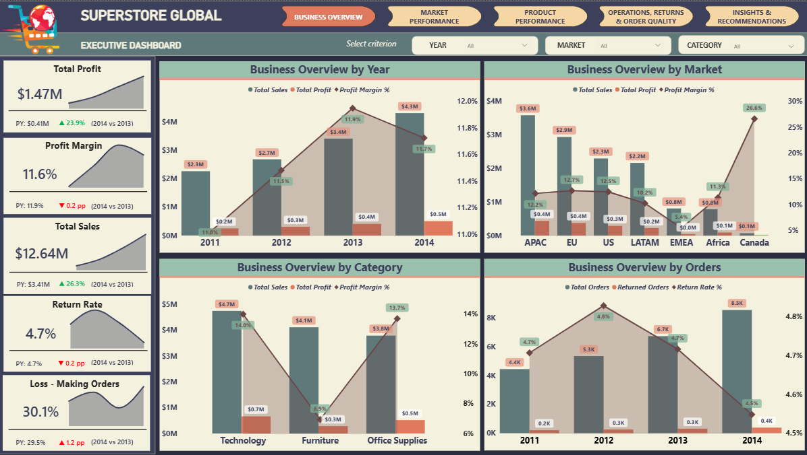
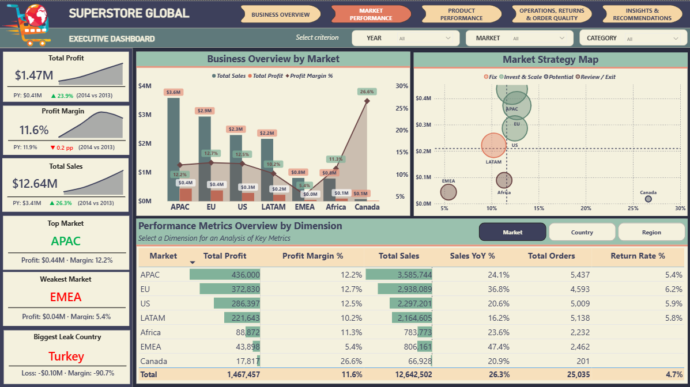
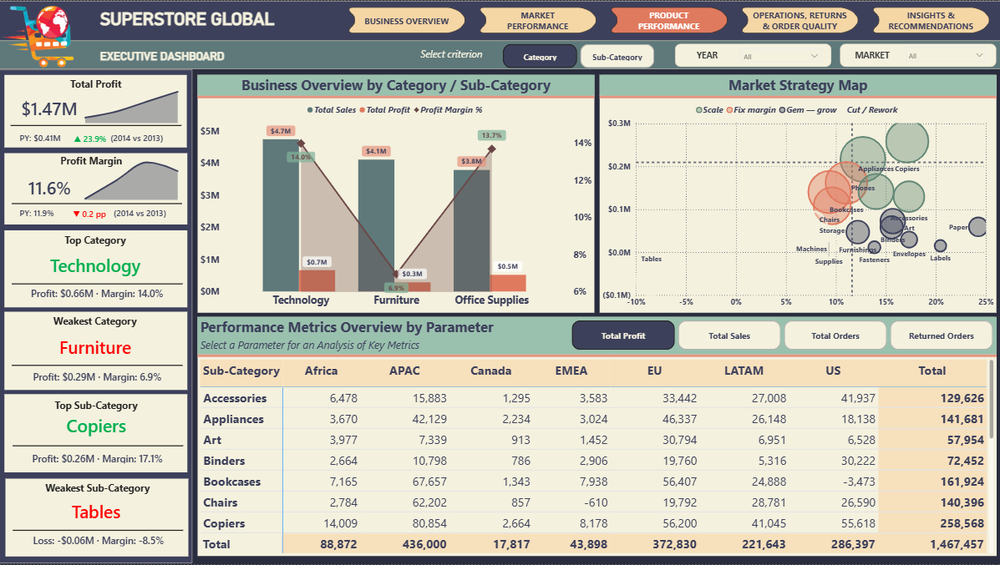
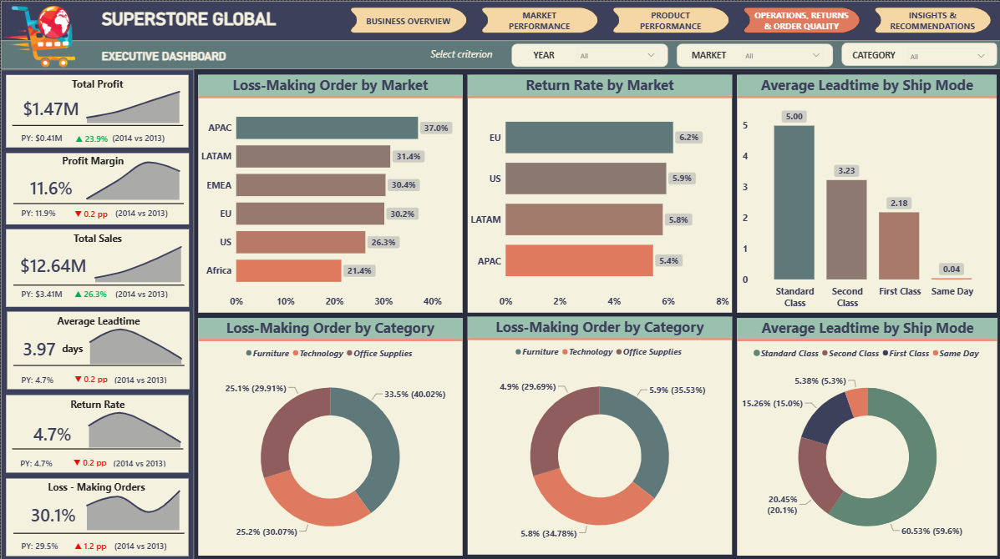
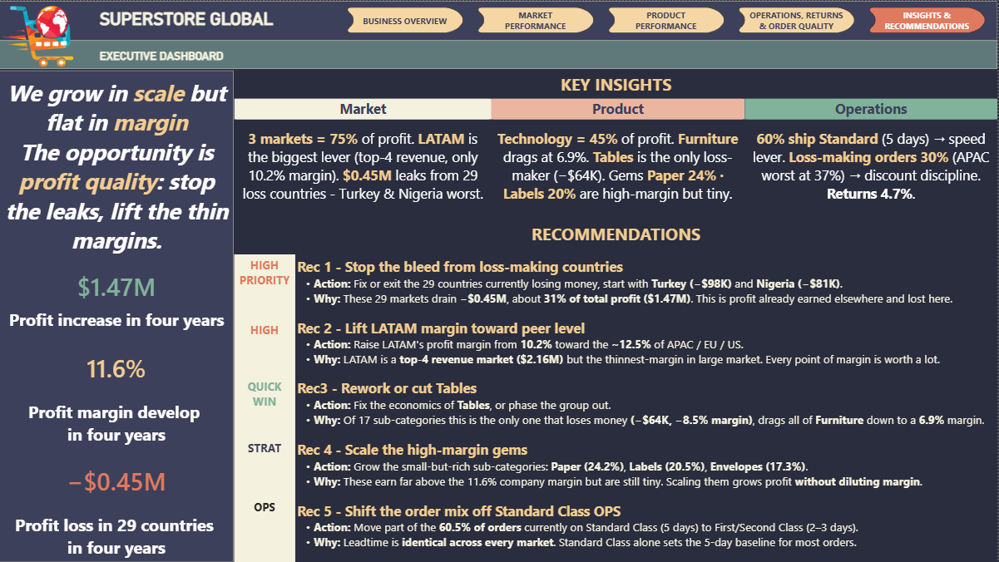

# Global Superstore Profitability Analytics — Power BI

A five-page Power BI report that turns four years of a global retailer's sales into decisions about **where to invest and which products to prioritise**, built from a single orders table modelled into a star schema and analysed through the lens of profit — not revenue.

|              |                                                                                                  |
| ------------ | ------------------------------------------------------------------------------------------------ |
| **Tools**    | Power BI Desktop, Power Query (M), DAX                                                            |
| **Dataset**  | Global Superstore (public sample dataset, accessed via BigQuery) — 51,290 order lines, 2011–2014 |
| **Records**  | 51,290 order lines · 25,035 orders · 7 markets · 147 countries                                   |
| **Model**    | Star schema — 1 fact + 5 dimensions + 2 classification tables + 3 field parameters, ~80 measures |
| **Pages**    | Business Overview · Market · Product · Operations & Returns · Insights                            |
| **File**     | [`Superstore_Dashboard.pbix`](Superstore_Dashboard.pbix)                                         |

> **Scope note.** The visual system — the left-hand anchor-scorecard column, the field parameters and the "by dimension" matrix — is shared with my earlier [PowerBI_HR_Workforce_Analytics](https://github.com/thaibui162/PowerBI_HR_Workforce_Analytics) project, kept deliberately consistent across my portfolio. New to this project are the **Design Thinking process** behind the page structure (§2), the Superstore data model and its ~80 DAX measures, the market and sub-category strategy-map framing, and all of the analysis below. The earth-tone colour palette is a published one.

---

## Key takeaways

- **Growing in scale, flat in margin.** Profit rose **+23.9% YoY** (2014 vs 2013) and sales **+26.3%**, but margin has sat at **~11.6% for four straight years** — growth is coming from selling *more*, not from selling *better*.
- **Profit is dangerously concentrated.** Three of seven markets — APAC, EU, US — carry **74.6% of all profit**, and **Technology alone is 45%**. The business rides on a narrow base.
- **$0.45M is leaking from 29 loss-making countries** — about **31% of total profit**. Turkey (−$98K, −90.7% margin) and Nigeria (−$81K, −148.6%) are the worst; fixing just those two recovers **~$0.18M**.
- **Tables is the only product group that loses money** (−$64K, −8.5% margin) and it drags Furniture — which earns nearly Technology's revenue at **6.9% margin**, a third of Technology's 14.0%.

---

## Table of contents

1. [Objective](#1-objective)
2. [Approach — Design Thinking](#2-approach--design-thinking)
3. [Dataset](#3-dataset)
4. [Data preparation in Power Query](#4-data-preparation-in-power-query)
5. [Data model](#5-data-model)
6. [Dashboard](#6-dashboard)
7. [Insights](#7-insights)
8. [Recommendations](#8-recommendations)
9. [What I learned](#9-what-i-learned)

---

## 1. Objective

Superstore sells across seven global markets and 147 countries and is growing fast. The General Manager responsible for global strategy has to decide where to put capital to expand market share and which products to make strategic — but the underlying data arrived as scattered regional reports in different currencies and formats, with no single profit-first picture.

The report answers four questions:

- What is the overall business situation and trend, in profit terms?
- Which markets deserve investment, and which should be fixed or reviewed?
- Which product groups drive profit, and which drain it?
- Where is profit leaking — loss-making orders and countries, returns, slow delivery?

The guiding metric is **Profit Margin %** (quality), supported by **Total Profit** (scale). Revenue is treated as size only: a large-revenue market is not automatically a good market.

---

## 2. Approach — Design Thinking

Before building anything, I ran the report through a Design Thinking process ([`Design_Thinking.xlsx`](Design_Thinking.xlsx)) so the dashboard would answer the manager's questions rather than show whatever the data happened to offer.

- **Empathise** — framed the reader as a General Manager making expansion and product decisions, and reduced their needs to the three questions above.
- **Define** — set the North Star as **Profit Margin %** (quality) supported by **Total Profit** (scale), and explicitly demoted revenue to "size only". Every later design choice was tested against this.
- **Ideate** — mapped each question to a page, and each page to three information layers: **headline scorecards → one strategic visual → supporting detail**. As the analysis deepened, an Operations & Returns page and a synthesis Insights page were added.
- **Prototype & iterate** — the layout went through several revisions, recorded in the workbook: static KPI text became dynamic measures; a four-row layout was compressed to three; a flat "leadtime by market" chart was replaced by the ship-mode mix once the data showed leadtime is identical across markets; and the strategy maps were set to ignore slicers that would otherwise collapse their quadrants.

The outcome is that every visual traces back to a decision the manager has to make, and the North Star — profit, not revenue — is visible on every page.

---

## 3. Dataset

The source is three related tables. The customer and product dimensions were split out of the orders table during modelling (see §5).

| Table     | Rows   | Role                | Key fields                                                                                                                    |
| --------- | ------ | ------------------- | --------------------------------------------------------------------------------------------------------------------------- |
| `Orders`  | 51,290 | Transaction fact    | Order ID, Order Date, Ship Date, Ship Mode, Customer ID, Product ID, Market, Region, Country, Category, Sub-Category, Sales, Quantity, Profit |
| `Returns` | 1,172  | Returned orders     | Order ID, Returned                                                                                                           |
| `People`  | 13     | Regional managers   | Person, Region                                                                                                              |

Grain of `Orders` is one **order line** (a product within an order); 51,290 lines resolve to 25,035 distinct orders spanning Jan 2011 – Dec 2014.

---

## 4. Data preparation in Power Query

The raw export looks tidy but is not model-ready. Every issue below breaks a measure if left in place.

### 4.1 Numeric columns stored as text

`Sales`, `Profit`, `Quantity`, `Average_Price` and `Leadtime_Days` all loaded as **text** (`"59.16"`, `"2"`). `SUM()` over a text column throws an error, so *every* core measure — Total Sales, Total Profit, Total Quantity — silently fails until the type is fixed.

**Fix:** Change Type to Decimal Number (money/price) and Whole Number (quantity, leadtime).

### 4.2 Dates stored as text in US format

`Order Date` and `Ship Date` arrived as text in `M/D/YYYY` form (`11/10/2012`). A plain type change on a US-format string in a non-US locale flips day and month.

**Fix:** Change Type With Locale = English (United States), then Date. Verified that no order fell outside 2011–2014.

### 4.3 Region mismatch between Orders and People

The orders table uses region **`EMEA`**; the managers table uses **`AMEA`** for the same region. Joined as-is, every EMEA order loses its Regional Manager and drops out of any manager-level analysis.

**Fix:** Replace Values `AMEA` → `EMEA` in People. All **13 of 13** regions now match, restoring the full manager scorecard.

### 4.4 Dedicated Date table

Auto date/time was turned off and a `Dim - Date` table built with `CALENDAR`, with **`Year` typed as a whole number**. This matters: the year-over-year logic compares `MAX(Year)` to `MAX(Year) - 1`, and a text `Year` column makes that comparison fail (returns blank), so YoY only works once Year is numeric and the table is marked as a date table.

### 4.5 Derived columns

| Column          | Definition                                    | Used for                     |
| --------------- | --------------------------------------------- | ---------------------------- |
| `Leadtime_Days` | Ship Date − Order Date                        | delivery-speed analysis      |
| `Average_Price` | Sales ÷ Quantity                              | price context                |
| `Return_Flag`   | 1 if the order appears in Returns, else 0     | order-level return rate      |

### 4.6 A data trap left in place, on purpose

**457 Product IDs map to more than one Product Name** in the source — the well-known Global Superstore inconsistency. Rather than "fixing" the names to match the report, I deduplicated `Dim - Product` to one name per ID and **always slice products by the dimension, never by the name column carried in the fact**. The trap is documented in [Limitations](#limitations) rather than hidden.

---

## 5. Data model

A star schema: `Fact - Orders` in the centre, five dimensions on single-direction relationships.

```
              Dim - Date
                  │
Dim - Customer ── Fact - Orders ── Dim - Product
                  │        │
             Dim - People  Dim - Returns
             (via Region)  (via Order ID)
```

Beyond the source dimensions, the model adds tables that hold **no source data**:

- **`Dim - Market`** and **`Dim - SubCategory`** — DAX calculated tables that classify each market / sub-category into a strategy quadrant (`Invest & Scale`, `Fix`, `Potential`, `Review / Exit`), so the scatter plots can colour bubbles by a stable group rather than by an ad-hoc measure.
- **Three field parameters** — `Market Dimension` (Market ↔ Country), `Product Dimensions` (Category ↔ Sub-Category) and `Product Metric` (Profit / Sales / Orders / Returned Orders). Each replaces a row of near-identical visuals with one visual whose axis or measure the user switches.
- **`Measure`** — a measure-only table so all ~80 measures live in one place.

### Selected measures

| Measure                | Definition                                                        |
| ---------------------- | ----------------------------------------------------------------- |
| `Total Profit`         | `SUM(Orders[Profit])`                                             |
| `Profit Margin %`      | `DIVIDE([Total Profit], [Total Sales])`                           |
| `Loss-Making Order %`  | share of orders that contain at least one negative-profit line    |
| `Return Rate %`        | returned orders ÷ total orders                                    |
| `Average Leadtime`     | `AVERAGE(Orders[Leadtime_Days])`                                  |
| `% of Total Profit`    | a market/product's profit ÷ the visible total                     |
| `Market Quadrant`      | 4-way `SWITCH` on profit vs average and margin vs average         |
| `Top / Weakest / Leak` | dynamic text measures that name the current best/worst market etc |

**Robust year-over-year.** Because the year slicer allows multi-select, YoY is anchored to the latest year in the selection versus the year before it — so it stays meaningful whether one year or several are selected:

```dax
Profit CY =
VAR y = MAX ( 'Dim - Date'[Year] )
RETURN CALCULATE ( [Total Profit], REMOVEFILTERS ( 'Dim - Date' ), 'Dim - Date'[Year] = y )

Profit PY =
VAR y = MAX ( 'Dim - Date'[Year] ) - 1
RETURN CALCULATE ( [Total Profit], REMOVEFILTERS ( 'Dim - Date' ), 'Dim - Date'[Year] = y )

Profit YoY % = DIVIDE ( [Profit CY] - [Profit PY], [Profit PY] )
```

Every KPI headline is a live measure, including the ones that read like text (`Top Market`, `Weakest Market`, `Biggest Leak Country`). Nothing on the report is a typed-in number, so the whole thing re-states itself when the data or the slicers change.

---

## 6. Dashboard

Every page carries the same three **anchor cards** — Total Profit, Profit Margin, Total Sales, each with a sparkline, YoY arrow and prior-year value — so a reader never has to return to the overview to keep the headline numbers in view.

### Page 1 — Business Overview



Five scorecards (Profit, Margin, Sales, Orders, Loss-Making Order %) beside three side-by-side combo charts showing Profit, Sales and Margin **by Year, by Market and by Category** at once, plus an order-quality breakdown (loss-making and returned orders as a share of total).

### Page 2 — Market Performance



A **strategy map** — a scatter of Total Profit × Margin % with average grid-lines splitting the seven markets into four action quadrants — next to a combo by market and a field-parameter table that drills Market → Country. Dynamic cards name the top market, the weakest market and the biggest loss-making country.

### Page 3 — Product Performance



A combo that switches Category ↔ Sub-Category by field parameter, a **Sub-Category strategy map** (Scale / Fix margin / Gem–grow / Cut–Rework) and a Sub-Category × Market matrix whose metric (Profit / Sales / Orders / Returned Orders) is switchable.

### Page 4 — Operations, Returns & Order Quality



Three themed rows: **leadtime** (by ship mode, and the ship-mode mix), **returns** (by market and category) and **order quality** (loss-making order % by market and category).

### Page 5 — Insights & Recommendations



A synthesis page: a thesis banner with live figures, three insight cards (Market / Product / Operations) that each compress several numbers into one decision, and a prioritised recommendation list. Every number is measure-driven so the page cannot drift from the model.

---

## 7. Insights

### 7.1 Scale is rising; margin is not

| Year | Sales   | Profit  | Margin | Orders |
| ---- | ------- | ------- | ------ | ------ |
| 2011 | $2.26M  | $249K   | 11.0%  | 4,440  |
| 2012 | $2.68M  | $307K   | 11.5%  | 5,343  |
| 2013 | $3.41M  | $407K   | 11.9%  | 6,721  |
| 2014 | $4.30M  | $504K   | 11.7%  | 8,531  |

Profit grew **+23.9%** into 2014 and orders **+26.9%**, so the business is expanding on every volume metric. But margin peaked in 2013 and *fell* slightly in 2014, and the four-year band (11.0%–11.9%) is essentially flat. The company is buying growth with volume, not efficiency — which means the largest untapped lever is margin, not more sales.

### 7.2 Four markets to scale, two to fix or exit

| Market | Sales  | Profit | Margin | Quadrant        |
| ------ | ------ | ------ | ------ | --------------- |
| APAC   | $3.59M | $436K  | 12.2%  | Invest & Scale  |
| EU     | $2.94M | $373K  | 12.7%  | Invest & Scale  |
| US     | $2.30M | $286K  | 12.5%  | Invest & Scale  |
| LATAM  | $2.16M | $222K  | 10.2%  | Fix (big, thin) |
| Africa | $0.78M | $89K   | 11.3%  | Review / Exit   |
| EMEA   | $0.81M | $44K   | 5.4%   | Review / Exit   |
| Canada | $0.07M | $18K   | 26.6%  | Potential       |

APAC, EU and US hold **74.6% of profit** — that is the base to protect. **LATAM is the single biggest lever**: it is a top-four revenue market but earns only 10.2% margin, so lifting it to peer level (12.7%) adds **~$53K** without a single extra sale. And the market averages hide sharp internal spread — inside APAC, North Asia runs a 19.5% margin while Southeast Asia runs **2.0%**, so "invest in APAC" really means "fix Southeast Asia inside APAC".

### 7.3 A third of profit is leaking from countries that lose money

| Country     | Profit  | Margin  |
| ----------- | ------- | ------- |
| Turkey      | −$98K   | −90.7%  |
| Nigeria     | −$81K   | −148.6% |
| Netherlands | −$41K   | −53.0%  |
| Honduras    | −$29K   | −32.7%  |
| Pakistan    | −$22K   | −38.1%  |
| Argentina   | −$19K   | −32.5%  |

**29 of 147 countries lose money, draining −$0.45M in total — about 31% of the company's entire profit.** These are not marginal losses: Turkey and Nigeria destroy 90–150 cents of profit per dollar of sales, which points at discounting or cost-to-serve rather than weak demand. Bringing just the top two to break-even recovers **~$0.18M** — more than lifting all of LATAM.

### 7.4 Technology carries the business; Furniture drags it

| Category         | Sales  | Profit | Margin | % of profit |
| ---------------- | ------ | ------ | ------ | ----------- |
| Technology       | $4.74M | $664K  | 14.0%  | 45.2%       |
| Office Supplies  | $3.79M | $518K  | 13.7%  | 35.3%       |
| Furniture        | $4.11M | $285K  | 6.9%   | 19.4%       |

Furniture takes almost as much revenue as Technology but returns **a third of the margin**. Drilling in, the cause is one sub-category: **Tables is the only loss-making group in the catalogue, at −$64K and −8.5% margin.** At the other end sit small, high-margin "gems" — **Paper (24.2%)**, **Labels (20.5%)** and **Envelopes (17.3%)** — which grow profit *without* diluting margin, the opposite of chasing revenue.

### 7.5 Delivery speed and loss-making orders are set by things markets don't control

Leadtime is **identical across all seven markets** — it is set entirely by ship mode (Same Day 0 days, First Class 2.2, Second Class 3.2, Standard Class 5.0). And **60.5% of all orders ship Standard Class**, so the only real speed lever is the shipping mix, not geography.

Loss-making orders tell a sharper story: **30.1% of all orders contain a loss**, and the worst market for it is **APAC at 37.0%** — the very market that earns the most profit. Winners are masking heavy discounting underneath. Furniture is the worst category at 33.5%.

---

## 8. Recommendations

1. **Stop the bleed — fix or exit loss-making countries.** 29 countries drain −$0.45M; Turkey and Nigeria alone are −$0.18M of that. Auditing discount depth and cost-to-serve here recovers earned profit without a single new sale — the highest-return, lowest-effort move on the board.
2. **Lift LATAM's margin toward its peers.** A top-four revenue market at 10.2% margin; closing the gap to the ~12.5% of APAC/EU/US adds **~$30K–$53K**. Target the weakest regions inside it rather than the market as a whole.
3. **Rework or cut Tables.** The only loss-making sub-category (−$64K). Break-even lifts both the line and Furniture's 6.9% margin — check freight cost on bulky items and discount levels before deciding.
4. **Scale the high-margin gems.** Paper (24.2%) and Labels (20.5%) are tiny today; growing them adds profit *and* improves the blended margin, directly serving the expansion goal without the margin dilution that chasing revenue would cause.
5. **Shift the shipping mix off Standard Class.** With 60.5% of orders on the 5-day mode and leadtime fixed by ship mode alone, moving high-value orders to faster classes is the one operational lever on delivery speed — piloted where speed matters, since faster modes cost more.

---

## 9. What I learned

- **The measures fail before the visuals do.** Sales, Profit and Quantity all loaded as text; every `SUM` errored until the types were fixed. I now check column data types before writing a single measure.
- **A one-value mismatch can erase a whole dimension.** `AMEA` vs `EMEA` is a single wrong word, but it silently removed an entire region's managers from every people-level analysis.
- **Year-over-year has to survive multi-select.** My first YoY broke the moment two years were selected. Anchoring it to `MAX(Year)` versus `MAX(Year) − 1` keeps it meaningful for any selection, and the KPI label states "(2014 vs 2013)" so the number can never be misread against a multi-year total.
- **Static narrative rots.** An earlier version typed the insight text by hand and the numbers drifted from the model. Every figure on the report is now a measure, so the page re-states itself when the data changes.
- **Field parameters replace duplicated visuals.** Three "by dimension / by metric" switchers took the place of a dozen near-identical charts.
- **The average hides the decision.** APAC looks healthy at 12.2% until you see Southeast Asia at 2.0% inside it. The insight was in the spread, not the headline.

### Limitations

- **Returns coverage is partial.** The Returns table only covers US, EU, LATAM and APAC; Africa, Canada and EMEA show 0% returns because they are *not tracked*, not because nothing is returned. Return metrics are valid only for the four covered markets.
- **Leadtime has no geographic signal.** It is fully determined by ship mode, so a "leadtime by market" view is intentionally omitted in favour of the ship-mode mix.
- **Product names are inconsistent at source** — 457 Product IDs carry more than one name. The model deduplicates to one name per ID and slices by the dimension; a name-level view would fragment products.
- **No discount field.** The data explains *that* orders and countries lose money, but not directly *why*; a discount column (present in some Superstore releases) would let the loss-making analysis attribute cause rather than infer it.
- **Impact figures are directional.** The recovery estimates ($0.18M, $53K, $64K) are order-of-magnitude, computed from the current model to support the decision — not commitments.
